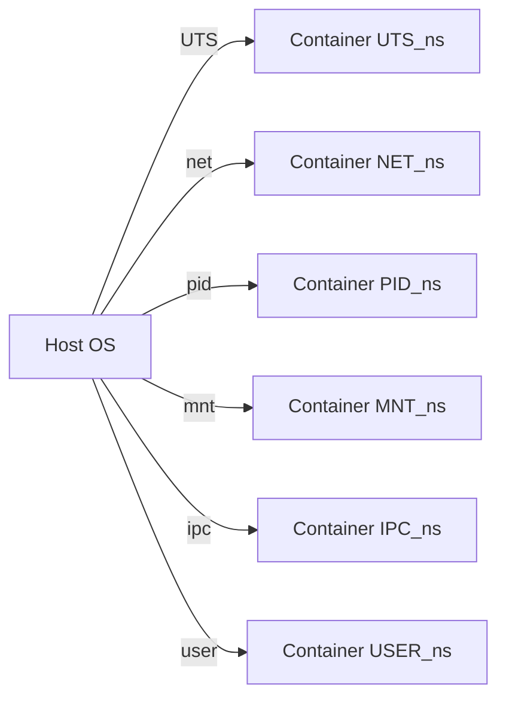

# Построение контейнера «с нуля» с Linux-namespace и cgroups

**Краткое содержание:** в этом руководстве описывается полный процесс создания простого изолированного контейнера в Linux без использования Docker. Будут подробно рассмотрены цели и ограничения контейнерной изоляции, необходимые возможности ядра и утилиты, подготовка минимального root-файлового пространства (rootfs) на основе Alpine, шаги по созданию отдельных пространств имен (namespaces) и монтированию `/proc`, настройке hostname и отображений пользователей, организации сетевого интерфейса через пару veth и мост (bridge), а также настройке cgroups (v1 и v2) для ограничения ресурсов CPU и памяти. Для каждого шага приведены конкретные команды и объяснения их работы, возможные ошибки и пути устранения, а также замечания по безопасности и сопоставление с тем, как это делается в Docker/containerd. В конце есть таблицы для сравнения типов namespaces и версий cgroups, чеклист необходимых опций ядра и возможностей.  

## Цели изоляции и модель угроз

Контейнеры Linux используют возможности ядра (пространства имён и cgroups) для изоляции процессов одного окружения от других. Это обеспечивает *изолированный вид* ресурсов: процессы в контейнере имеют собственное дерево процессов (PID), файловую систему, сетевой стек и т. д., отдельные от хоста. Однако контейнеры **не задумывались как полноценная граница безопасности** (security boundary). Они разделяют **общее ядро ОС** с хост-системой, поэтому уязвимость в ядре или неправильная настройка могут позволить процессам из контейнера «выйти» наружу. Например, утилита `chroot()` лишь меняет корневой каталог процесса и **не даёт полной песочницы**. По этой же причине контейнеры не подходят для незащищённого многопользовательского окружения. Короче говоря, контейнер хорошо изолирует среду выполнения (отдельные PID, сеть, файловые системы и т.п.), но **все контейнеры доверяют одному ядру**. Как отмечено, «контейнеры обеспечивают изоляцию ресурсов с общим ядром, но не предназначены для враждебного многопользовательского использования».

Тем не менее такой уровень изоляции достаточен для большинства сценариев контейнеризации приложений (где контейнеры гарантируют отдельный namespace, отдельную файловую систему, управление ресурсами и тому подобное, как и Docker), но важно помнить, что рутовые привилегии внутри контейнера **могут использовать возможности ядра** для выхода в систему. Поэтому всегда учитывайте модель угроз: контейнер защищает от случайного вмешательства и конфликтов ресурсов, но не заменяет VM для высокой безопасности, если кому-то нужен «железобетонный» барьер.

## Требуемые возможности ядра и утилиты

### Опции ядра и разрешения

Для работы контейнеризации требуются следующие опции конфигурации ядра (в `make menuconfig`):  
- **CONFIG_NAMESPACES=y** – включение вообще пространства имён.  
- **CONFIG_UTS_NS, CONFIG_IPC_NS, CONFIG_PID_NS, CONFIG_NET_NS, CONFIG_USER_NS, CONFIG_CGROUP_NS** – отдельные флаги для каждого типа пространства имён (UTS, IPC, PID, NET, User, Cgroup).  
- **CONFIG_CGROUPS=y** – поддержка cgroups (контроль групп).  
- Контроллеры cgroups: **CONFIG_CGROUP_CPUACCT, CONFIG_CGROUP_DEVICE, CONFIG_CPUSETS, CONFIG_CGROUP_FREEZER, CONFIG_CGROUP_MEM_RESCTRL** и т.д. для ограничения ЦП, памяти и т.д. (обычно включено в современных ядрах, см. `lxc-checkconfig`).  
- **CONFIG_NETFILTER** или **CONFIG_BRIDGE_NETFILTER** может понадобиться для NAT (маскарадинг) при пробросе трафика.  

Также процессу требуется достаточный набор возможностей (capabilities): в общем случае нужны `CAP_SYS_ADMIN` (для создания почти всех namespaces, подключения файловых систем и т.п.) и `CAP_SYS_CHROOT` (для `chroot()`), `CAP_NET_ADMIN` для манипуляций с сетями, `CAP_MKNOD/CAP_DAC_OVERRIDE` для монтирования псевдофайловых систем. Проще всего выполнять эти действия под **root**, иначе многие операции (unshare, mount, ip link и т.д.) выдадут `Operation not permitted`.  

*Чеклист важнейших опций ядра и возможностей:*
- **Namespaces:** имена переменных `CONFIG_UTS_NS`, `CONFIG_IPC_NS`, `CONFIG_PID_NS`, `CONFIG_NET_NS`, `CONFIG_USER_NS`, `CONFIG_CGROUP_NS` (и общий `CONFIG_NAMESPACES`).  
- **Cgroups:** `CONFIG_CGROUPS`, `CONFIG_CPUSETS`, `CONFIG_CGROUP_CPUACCT`, `CONFIG_CGROUP_DEVICE`, `CONFIG_CGROUP_MEM_RESCTRL` и пр.  
- **Сетевые модули:** `CONFIG_VETH` (виртуальные Ethernet), `CONFIG_BRIDGE`, `CONFIG_BRIDGE_NETFILTER` (iptables на мости).  
- **Pseudofs:** `CONFIG_PROC_FS`, `CONFIG_SYSFS`, `CONFIG_DEVPTS_FS` (для /proc, /sys, /dev/pts внутри контейнера).  
- **Capabilities:** обычный root (или выше) для всех операций; при создании user-namespace без дополнительных возможностей можно передать себя в контейнере, но под root проще.  

### Необходимые утилиты

Для пошагового создания контейнера понадобятся: 
- **`unshare(1)`** (из пакета util-linux) – для запуска процессов в новых пространствах имён.  
- **`chroot(1)`** – для смены корневого каталога на подготовленный rootfs.  
- **`nsenter(1)`** – (опционально) для входа в уже созданное пространство имён из хоста.  
- **`ip`** (iproute2) – для работы с сетевыми пространствами, интерфейсами `veth`, мостами и адресами (см. `ip-netns(8)`).  
- **`iptables`** или **`nft`** – для настройки NAT/маршрутизации контейнера.  
- **`cgcreate`, `cgexec`** (из libcgroup) или **`systemd-run`/`systemd-cgls`** – для управления cgroups.  
- **`nsenter`** также упрощает отдельные шаги (см. пример ниже).  
- Дополнительно: `wget, tar` для загрузки/распаковки Alpine-образа, `mount` и другие стандартные утилиты.  

Утилиты упомянуты для примеров команд: мы будем показывать команды `ip`, `iptables`, `cgcreate`/`systemd` и др. с учётом их официальной документации.

## Подготовка минимального rootfs (Alpine)

Контейнеру необходим собственный корневой каталог (rootfs) — минимальная файловая система. Популярный подход – использовать Alpine Linux, т.к. у него есть *rootfs-minimal* образ. Alpine предоставляет «мини-образ» (minirootfs) в виде tarball. На странице загрузок указано: *“Mini root filesystem – Minimal root filesystem. For use in containers and minimal chroots.”*.  

**Шаги подготовки:**  
1. Создать папку для контейнера, например `/mycontainer`.  
2. Скачать Alpine minirootfs и распаковать:  

```bash
sudo mkdir /mycontainer
sudo wget -O alpine-minirootfs.tar.gz \
  https://dl-cdn.alpinelinux.org/alpine/v3.24/releases/x86_64/alpine-minirootfs-3.24.0-x86_64.tar.gz
sudo tar -xzf alpine-minirootfs.tar.gz -C /mycontainer
```

Ожидаемый эффект: в `/mycontainer` появится минимальная ОС Alpine со структурой `/bin, /lib, /etc, /proc`, и базовым набором утилит (sh, busybox, apk и др.). Можно проверить, что в `/mycontainer/bin/sh` есть шеловый линк на Alpine.  

**Ошибки:** если нет сети или неверный URL – wget выдаст ошибку. Убедитесь, что URL актуален (на Alpine-странице выберите последнюю версию). Привилегии root нужны для записи в `/mycontainer`.  

**Безопасность:** установка rootfs отдельно от текущей системы уже даёт начальную изоляцию файловой системы; важно не монтировать ничего лишнего автоматически. Внутри контейнера мы позже смонтируем `/proc`, `/sys` и т.п. из специальных псевдо-FS.  

## Шаг за шагом: создание контейнера

Теперь, имея подготовленный rootfs, приступим к непосредственному созданию контейнера. Мы будем выполнять последовательность команд, демонстрируя, какие пространства имён создаются, что монтируется и как настраивается сеть и cgroups. Предполагается, что все команды выполняются с правами root (или через sudo). 

### 1. Запуск нового процесса с namespace через `unshare`

Команда `unshare` позволяет создать новый процесс в отдельных namespace. Например, следующий однострочный пример создаёт новый PID-, UTS-, IPC-, NET-, CGROUP- и USER-namespace и запускает там shell с новым `/proc` (флаг `--mount-proc`):

```bash
sudo unshare \
    --fork --pid --mount --uts --ipc --net --cgroup --user --map-root-user --mount-proc \
    chroot /mycontainer /bin/sh
```

Разбор флагов:
- `--fork` (`-f`): форкать ребёнка для нового PID-namespace (чтобы его init-процесс имел PID 1).
- `--pid`, `--uts`, `--ipc`, `--net`, `--cgroup`, `--user`: создать отдельные простанства имён PID, UTS, IPC, NET, Cgroup, User.  
- `--map-root-user` (`-r`): в новом user-namespace мапить root -> текущий UID, чтобы внутри контейнера мы были «root».  
- `--mount`: создать отдельный mount-namespace.  
- `--mount-proc`: автоматически смонтировать `/proc` в новом пространстве PID (иначе `ps` и др. внутри не работают).  
- `chroot /mycontainer /bin/sh`: после создания namespace переключиться на корневой каталог `/mycontainer` и запустить там shell.  

Если команда прошла успешно, вы попадёте в новый шелл, и prompt изменится, например `/#`. Этот процесс стал **PID 1** внутри контейнера (новое PID-namespace), с изолированным `hostname`, сетями и т.д. Можно проверить это: 

```bash
# внутри контейнера (обратите внимание, что теперь urandom и команда hostname относятся к контейнеру)
# установить hostname
hostname container1
# убедиться, что PID-namespace новый
ps aux
```

*Ожидаемый результат:* в контейнере PID 1 – это ваша shell-команда. Команды `ps`, `top` покажут только процессы внутри (для PID=1 parent PID будет 0).  

*Ошибки и их исправления:*  
- **“Operation not permitted”** при `unshare` говорит, что нет нужных возможностей (CAP_SYS_ADMIN и др.) – нужно запустить от root.  
- Если `newuidmap: not found`, необходимо установить пакет `uidmap`.  
- Если `mount-proc` не сработал, то внутри контейнера отсутствует `/proc`. В этом случае вручную выполните: `mount -t proc proc /proc`.  
- Удостоверьтесь, что `/mycontainer` содержит рабочий `bin/sh`; иначе `chroot` завершится ошибкой (`command not found`).  

### 2. Монтирование /proc, /sys, /dev

Хотя мы указали `--mount-proc`, для полноты обычно делаем явные монтирования. Внутри контейнера (в shell PID 1) выполните:

```bash
mount -t proc proc /proc
mount -t sysfs sysfs /sys
mount -t devtmpfs udev /dev
mount -t devpts devpts /dev/pts
```

Это позволит процессам видеть виртуальные файловые системы (`/proc`, `/sys`, устройства в `/dev`). После этого можно пользоваться командами вроде `ps`, `lsusb`, `df`, `ls /dev`. Например:  

```bash
ps -ef       # покажет PID1 = /bin/sh в контейнере
ip link      # покажет внутри только интерфейс lo, пока сеть не настроена
```

*Ошибки:*  
- Если `mount: permission denied`, убедитесь, что вызываете под root и с правами на создание mount (обычно в новых mount-namespaces требуются права).  
- Если `mount: unknown fs type` – это маловероятно, если ядро собрано с поддержкой proc/sysfs/devtmpfs.

*Безопасность:* монтирование `/dev` через `devtmpfs` обычно безопасно в новом mount namespace, потому что видна только `udev`-структура для устройств ядра. При желании можно смонтировать ещё `tmpfs /dev/shm`, чтобы обеспечить /dev/shm.

### 3. Установка hostname

В UTS-namespace изоляции можно менять имя хоста без влияния на хост-машину. Например:

```bash
hostname mycontainer
```

После этого внутри контейнера `hostname` выведет новое имя, а на хосте оно останется прежним. Это чисто косметическая настройка, но часто используется, чтобы контейнер видел себя под своим именем.  

*Комментарий:* Docker аналогично устанавливает `hostname` контейнера; по умолчанию это часть ID контейнера или задаётся ключом `--hostname`. Мы делаем то же вручную. (UTS-namespace — это изолированное имя хоста.)

### 4. Отображение пользователей (user namespace)

Мы уже использовали флаг `--user --map-root-user` в `unshare`, чтобы иметь UID 0 внутри контейнера. Детали: если нужен пользовательский namespace, важно настроить `/proc/self/uid_map` и `/proc/self/gid_map`. Но `unshare --map-root-user` автоматизирует маппинг текущего пользователя в root внутри контейнера (как показано в примере man unshare). 

Если запускаем не под root, а под обычным пользователем, нам потребуется утилита `newuidmap/newgidmap` и файлы `/etc/subuid`/`/etc/subgid`. Это сложнее, поэтому в данном руководстве для простоты предполагается запуск под root. При необходимости можно задать ручные маппинги:

```bash
# пример (обычно не требуется при --map-root-user)
echo 0 1000 1 > /proc/$$/uid_map
echo 0 1000 1 > /proc/$$/gid_map
```

где 1000 – ваш внешний UID.  

*Ошибки:* если `newuidmap: error`, это указывает на отсутствие записи в `/etc/subuid`. Решение – добавить текущему пользователю диапазон ID.  

### 5. Настройка сети: veth и bridge

По умолчанию после `unshare --net` в контейнере доступен только loopback (`lo`), и никакого соединения с хостом или другими сетями нет. Мы создадим пару виртуальных Ethernet-интерфейсов (veth), соединяющую хост и контейнер, и подключим один конец к бриду на хосте:

1. **На хосте** (не в контейнере) создаём veth-пару и мост:

```bash
# Назначаем интерфейсы
ip link add veth-host type veth peer name veth-container
# Поднимаем хостовый интерфейс
ip link set veth-host up
# Создаём виртуальный мост br0 (если ещё нет)
ip link add name br0 type bridge
ip addr add 10.0.0.1/24 dev br0    # IP-адрес мосту
ip link set br0 up
# Добавляем veth-host к мосту
ip link set veth-host master br0
```

2. **Перемещение контейнерного конца в net namespace:**  

Нужно узнать PID процесса контейнера на хосте. Предположим, что в контейнере PID 1 – наша shell. Найдём его с хоста, например:

```bash
CONTPID=$(pgrep -f "/mycontainer")
```

3. **Перенос интерфейса во namespace контейнера:**

```bash
ip link set veth-container netns $CONTPID
```

4. **Настройка внутри контейнера:**  

```bash
# Внутри контейнера (или через nsenter -t $CONTPID -n ...)
ip link set lo up               # активируем loopback
ip link set veth-container up    # активируем второй конец veth
ip addr add 10.0.0.2/24 dev veth-container
ip route add default via 10.0.0.1   # шлюз – адрес на мосту
```

После этого контейнер получит интерфейс `veth-container` с адресом `10.0.0.2`, а хостовая сторона на мосту `br0` – `10.0.0.1`. Контейнер сможет пинговать хост (`ping 10.0.0.1`) и наоборот.  

*Проверим связь:* из контейнера:

```bash
ping -c 2 10.0.0.1   # должен быть отклик от хоста
```

И с хоста:

```bash
ping -c 2 10.0.0.2   # пинг до контейнера через мост
```

*Ошибки:*  
- **`RTNETLINK answers: Operation not permitted`** при `ip link set veth-container netns`: запускали без root или без CAP_NET_ADMIN. Нужно root.  
- **`Device "br0" does not exist`**: создайте мост заранее (`ip link add br0 type bridge`).  
- Если контейнер не пингуется: проверьте, что оба конца veth подняты (`ip link set ... up`), и что адреса не конфликтуют. Иногда требуется включить ip_forward и iptables NAT (см. ниже).  

*Замечание:* В Docker по умолчанию создаётся мост `docker0` и подключаются veth-пары контейнеров в этот мост. Мы повторили этот механизм вручную. Важно упомянуть, что настроенный таким образом контейнер уже имеет изолированную сеть: собственный routing table, iptables (netfilter) и т.д. (как описано в `ip-netns(8)`).  

### 6. Настройка ограничений ресурсов (cgroups)

Теперь ограничим ресурсы контейнера через cgroups. Рассмотрим пример на cgroups v2 (совмещённая иерархия, современный вариант). Первично нужно примонтировать файловую систему cgroup2:

```bash
mount -t cgroup2 none /sys/fs/cgroup
```

Затем создадим подгруппу, назначим контроллеры и лимиты. Например, ограничим CPU 20% и память 512 МБ:

```bash
# создаём директорию группы
mkdir /sys/fs/cgroup/mygroup
# включая контроллеры cpu и memory
echo "+cpu +memory" > /sys/fs/cgroup/mygroup/cgroup.subtree_control
# задаём лимиты
echo "20000 100000" > /sys/fs/cgroup/mygroup/cpu.max     # 20% из 100000 (т.е. 20000)
echo $((512*1024*1024)) > /sys/fs/cgroup/mygroup/memory.max   # 512MB
# добавляем все процессы текущего контейнера в cgroup
echo $$ > /sys/fs/cgroup/mygroup/cgroup.procs
```

Где `$$` – PID этого процесса (1) внутри контейнера. После этого процессы контейнера будут ограничены. Если контейнер пытается использовать больше CPU (часы) или более 512 МБ памяти, ограничения вступят в силу. 

Для cgroups v1 аналогичным образом можно использовать утилиты `cgcreate`, `cgset`, `cgexec`:

```bash
# Пример для v1 (если используется cgroupfs v1)
cgcreate -g cpu,memory:/mygroup
cgset -r cpu.cfs_quota_us=20000 mygroup
cgset -r cpu.cfs_period_us=100000 mygroup
cgset -r memory.limit_in_bytes=536870912 mygroup
cgexec -g cpu,memory:mygroup /bin/bash
```

В этом случае `cgexec` запустит Bash в заданной группе, ограниченной CPU до 20% и памятью до 512MB.  

**Таблица сравнения cgroups v1 vs v2:**  

| Особенность              | Cgroups v1                                   | Cgroups v2                                    |
|--------------------------|----------------------------------------------|-----------------------------------------------|
| Иерархия                 | Несколько иерархий (для каждого контроллера) | Одна унифицированная иерархия    |
| Настройка контроллеров   | Контроллеры (`cpu`, `memory` и т.д.) монтируются отдельно | Контроллеры «подключаются» к группам через `cgroup.subtree_control` |
| Формат лимитов CPU       | cpu.cfs_quota_us / cpu.cfs_period_us         | cpu.max (две величины: квота/период)           |
| Формат лимитов памяти   | memory.limit_in_bytes                        | memory.max                                    |
| Дополнительные контроллеры| (все: cpuacct, cpuset, blkio, etc)           | Пока CPU, IO, Memory, PIDs      |
| Пользовательские возможности | `cgcreate`, `cgexec` из libcgroup или systemd | `systemd-run --slice` или ручное echo в `/sys/fs/cgroup` |

*Ссылки:* документ ядра по cgroup v2 подробно описывает концепции, а из официального Red Hat-руководства узнаём, что в v1 “cgroups связаны с контроллерами, а в v2 контроллеры привязываются к группам”, и какие контроллеры есть по умолчанию.  

### 7. Запуск процесса и поддержание контейнера

Чтобы контейнер «жил», в нём должен работать, например, процесс init (PID 1). В нашем примере мы уже под управлением `/bin/sh` с PID 1. В реальной ситуации можно запустить служебный скрипт или демона. Пример удержания (демон):
```bash
# Внутри контейнера
echo "Container is running"; tail -f /dev/null
```
Простой `tail -f /dev/null` удерживает shell открытым, пока контейнер запущен. Аналогично Docker обычно запускает CMD приложения.  

Здесь важно: если PID 1 (`/bin/sh`) выходит, то контейнер завершится. Поэтому для долгосрочных контейнеров PID1 нужно оставить активным (например, системный init, supervisord, или бесконечный цикл).  

*Сравнение с Docker:* Docker/Containerd при старте контейнера выполняют похожие шаги: runc (или другой runtime) вызывает clone/unshare, устанавливает cgroups, настраивает сеть с veth/bridge, монтирует файловые системы (`proc`, `/etc/resolv.conf`, tmpfs в `/dev` и т.д.), задаёт UID/GID mapping и выполняет init-процесс внутри контейнера. Наше руководство вручную повторяет этот процесс.  

### 8. Очистка (Cleanup)

После работы следует удалить созданные ресурсы:  

- **Снять ограничения cgroups:** например, выполнить `rmdir /sys/fs/cgroup/mygroup`.  
- **Удалить интерфейсы и namespaces:**  
  ```bash
  # С хоста:
  ip link delete veth-host   # удалит и veth-host, и соответствующий veth-container
  ip link delete br0         # удалить мост (если не нужен)
  # Если использовали ip netns add:
  ip netns delete contns     # удалить запись netns (некритично)
  ```
- **Прервать процесс в контейнере:** просто выйти из shell или послать SIGTERM PID 1, либо `kill $CONTPID`.  
- **Демонтировать псевдо-FS:** Если монтировали вручную:
  ```bash
  umount /mycontainer/proc
  umount /mycontainer/sys
  umount /mycontainer/dev/pts
  umount /mycontainer/dev
  ```
- **Удалить папку контейнера:** когда все процессы остановлены, можно удалить `/mycontainer`.  

В идеале нужно делать это в правильном порядке (сначала kill-процессы, потом умонтировать, потом удалить файлы). Если что-то “зависло”, смотрите журнал ошибок или статус процесса. Команда `systemd-cgls` (из systemd) покажет дерево процессов в cgroup, если контейнеры запускались через systemd.

## Сравнение пространств имён

Ниже приведена сводная таблица основных namespaces, какие ресурсы они изолируют и через какой флаг создаются (упрощённо на основе `namespaces(7)`):

| Пространство имён   | Ключ CLONE_NEW*       | Изолируемые ресурсы                                   |
|--------------------|----------------------|-------------------------------------------------------|
| **mount (mnt)**    | CLONE_NEWNS (unshare `-m`) | Точки монтирования (файловые системы)               |
| **UTS (uts)**      | CLONE_NEWUTS (`-u`)       | Hostname и доменное имя NIS                         |
| **IPC**            | CLONE_NEWIPC (`-i`)       | Системы System V IPC, POSIX message queue            |
| **net (сеть)**     | CLONE_NEWNET (`-n`)       | Сетевые интерфейсы, таблицы маршрутизации, сокеты    |
| **PID (процессы)** | CLONE_NEWPID (`-p`)       | Нумерация PID внутри контейнера                     |
| **cgroup**         | CLONE_NEWCGROUP (`-C`)    | Виртуальный вид на `/proc/self/cgroup`              |
| **user**           | CLONE_NEWUSER (`-U`)      | UID/GID и набор возможностей (`capabilities`)        |
| **time**           | CLONE_NEWTIME (`-T`)      | Изменяемый сдвиг CLOCK_MONOTONIC/BOOT_TIME         |

Каждый процесс принадлежит одному пространству каждого типа. Например, при запуске `unshare -p` вы создаёте новый PID-namespace: у вас будет собственная нумерация PID (PID 1,2,3 в контейнере), не пересекающаяся с хостом.  

*Порядок и вложенность:* пространства имён могут быть вложены: например, PID-namespace «дочерний» по отношению к тому, что его создал. Новый user-namespace позволяет процессам стать root внутри, при этом все остальные namespaces становятся «дочерними» этому user-namespace. Подробнее см. схему ниже.  



*Диаграмма:* каждая стрелка показывает создание нового пространства имён (например, NET, PID и др.) – процессы контейнера видят только свои ресурсы.

## Модель работы при старте контейнера

Ниже схема-порядок основных шагов создания контейнера:  

```mermaid
flowchart TD
  A[Подготовка rootfs и прав] --> B[Создание пространств имён (unshare)]
  B --> C[Бинд-монтаж /proc, /sys, /dev]
  C --> D[Настройка hostname и UID/GID]
  D --> E[Настройка сети (veth, bridge, IP)]
  E --> F[Ограничение cgroups (CPU, память)]
  F --> G[Запуск процесса внутри контейнера (PID 1)]
  G --> H[Контейнер запущен и изолирован]
```

Здесь последовательность примерно отражает «жизненный цикл» – от подготовки образа до того, как контейнер функционирует. 

## Вывод

Мы рассмотрели полный ручной процесс запуска контейнера: от подготовки Alpine rootfs до настройки namespaces (mnt, uts, ipc, net, pid, user, cgroup), монтирования псевдо-FS, установки сети через veth+bridge и ограничения ресурсов cgroups. Для каждого этапа даны команды и пояснения. Обратите внимание, что все эти шаги эквивалентны внутренним действиям контейнерных сред (Docker, containerd/runc): когда вы `docker run`, на самом деле Docker вызывает runc, который использует точно такой же механизм `clone`/`unshare`, `mount`, `ip`, `iptables` и т.д. (например, «namespace wraps a global resource to give isolated instance»).

В результате получился полифункциональный контейнерный init-процесс: он имеет отдельный PID 1, свою файловую систему, сетевое окружение, ограничения по CPU/памяти. Эта изоляция позволяет запускать приложения в «песочнице», хотя, как упоминалось, не стоит считать контейнер абсолютной защитой: ядро всё ещё общее. Тем не менее такой подход на 100% повторяет функциональность Docker-образа, но реализован вручную «с нуля».

**Источники:** основные концепции описаны в официальных мануалах ядра и утилит: `unshare(1)`, `namespaces(7)`, `ip-netns(8)`, `chroot(2)` и документации Alpine и systemd. Также использована авторитетная документация и блоги (см. ссылки выше) для примеров конфигурации сети и cgroups.