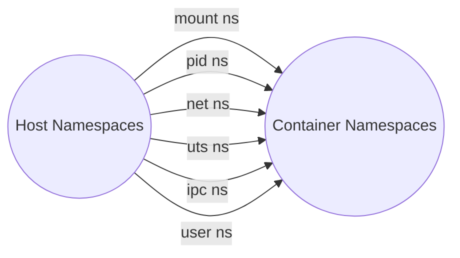
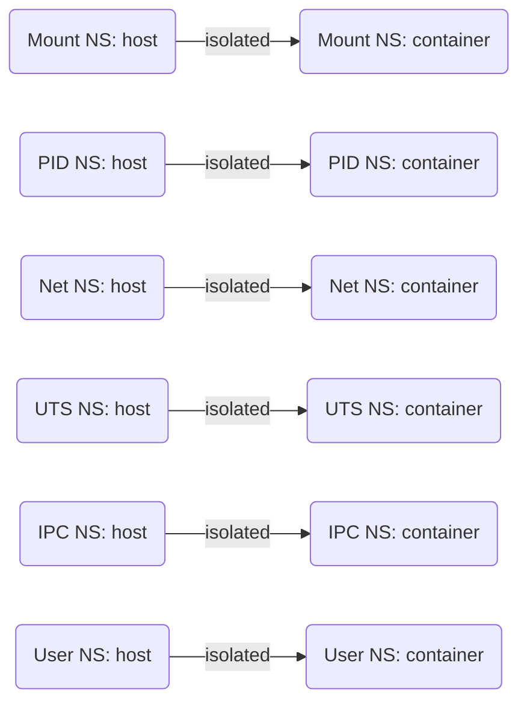

**Executive Summary:** A Linux “container” is essentially a regular process that has its own isolated view of the operating system, achieved through kernel features like namespaces and cgroups. Unlike a simple `chroot`, which only changes the filesystem root and “*does nothing else*”, a true container isolates process IDs (PID), networking, user IDs, and more, giving it a mental model similar to a lightweight virtual machine. This guide explains the purpose of containers, how each Linux namespace (mount, PID, UTS, IPC, net, user, etc.) works, and walks through creating a fully-functional container from scratch on Linux. We use an Alpine Linux *mini-rootfs* for the container’s root filesystem, `unshare` and `chroot` to enter that filesystem, and set up basic networking (via a veth pair and bridge) and resource limits (via cgroups). We also cover mounting `/proc` and `/sys`, setting the hostname and UID mappings in a user namespace, example scripts, verification steps, common pitfalls, and security considerations. Throughout, we cite official documentation (man-pages, kernel docs, Alpine docs) and reputable tutorials.

## Purpose and Mental Model of Containers

A container is **not** a VM but a set of namespaces and cgroups applied to one or more processes. The **mental model** is “a process with an alternate view of the system.” Namespaces partition kernel resources so that processes in one namespace see their own set of filesystems, processes, network interfaces, etc., separate from the host or other containers. By combining namespaces and cgroups (for resource limits), a container can safely co-exist with others on the same kernel, without interfering (in well-configured setups).

Key points:
- A container’s filesystem root is usually an unpacked image (we’ll use Alpine’s minirootfs). This is similar to `chroot`, but to get true isolation we also use additional namespaces.
- **Chroot vs Container:** The traditional `chroot` call merely changes the process’s filesystem root and “does nothing else”.  It was *not* designed as a security boundary. In contrast, a container also has new PID, network, IPC, UTS, and optionally user namespaces, so that processes see only what’s inside the container. For example, in a new PID namespace, the container’s first process is PID 1, independent of the host’s PIDs.
- Isolation: With namespaces, changes inside the container (mounts, hostname changes, etc.) do not leak to the host. For instance, the mount namespace ensures that “mounting and unmounting filesystems will not affect the rest of the system”. Similarly, a UTS namespace lets the container set its own hostname without affecting the host, and a network namespace gives it independent network interfaces and routing tables.

Below we explain each relevant namespace and other pieces in detail.

## Linux Namespaces: Mount, PID, UTS, IPC, Net, User, (and Others)

The `unshare(1)` and kernel docs describe each namespace. In brief:

- **Mount namespace (`CLONE_NEWNS`)**: Isolates filesystem mounts. In a new mount namespace, “mounting and unmounting filesystems will not affect the rest of the system”. In practice this means `mount` and `umount` inside the container stay private (unless you bind-mount with shared propagation). By default, `unshare` makes mounts private in the new namespace.

- **PID namespace (`CLONE_NEWPID`)**: Gives the container its own process ID space. The first process (the “init” in that container) is PID 1. Other processes in the container have PIDs starting from 2, etc., unrelated to host PIDs. For example, running 
  ```bash
  unshare --fork --pid --mount-proc readlink /proc/self
  ```
  shows “1”, indicating the new shell is PID 1 in its namespace.

- **UTS namespace (`CLONE_NEWUTS`)**: Isolates the hostname and NIS domain. You can set a container-specific hostname (`hostname ...`) without changing the host’s name.

- **IPC namespace (`CLONE_NEWIPC`)**: Separates System V IPC (message queues, semaphores) and POSIX message queues. Processes in one namespace do not see the IPC objects of another.

- **Network namespace (`CLONE_NEWNET`)**: Gives each container its own network stack. Inside, the container sees its own interfaces, IP addresses, routing tables, firewall rules, etc., and does not see the host’s interfaces (other than the loopback). For example, an empty new net namespace starts with only `lo` (loopback) interface and no access outside.

- **User namespace (`CLONE_NEWUSER`)**: Allows UID/GID remapping. Inside the container’s user namespace, a process can have UID 0 (root) while being unprivileged on the host. The kernel quotes explain: “The process will have a distinct set of UIDs, GIDs and capabilities”. Typically one uses `--map-root-user` or related `unshare` options so that the invoking user maps to root inside the container. This enables creation of device files or mounts inside the container without host privileges.

- **Cgroup namespace (`CLONE_NEWCGROUP`)**: (for completeness) virtualizes the view of the cgroup filesystem (shows only the container’s cgroup subtree).

- (Other namespaces like time namespaces exist, but are beyond our focus.)

Each namespace can be created with `unshare` (or clone with flags). For example, `unshare -m -p -u -i -n` creates new mount, PID, UTS, IPC, and net namespaces. The man page `unshare(1)` has many examples of using these flags.


*Diagram: Conceptual view of host vs container namespaces. Each arrow indicates that the container has a separate (isolated) namespace of that type.*

### Difference from `chroot(2)`:

It is important to note that **`chroot` by itself is not containerization**. The `chroot(2)` call “changes an ingredient in the pathname resolution” (the root directory) but “does nothing else” for isolation. A process inside a `chroot` can still see all host processes, network, and even, under some circumstances, break out of the jail (by `chdir("..")` tricks as the manpage warns). In contrast, real containers use namespaces *in addition to* a changed root to isolate all aspects of execution. As one security review notes, `chroot` *“was never intended as a security device”* and is easily escaped. In our setup we use `chroot` only to change the filesystem root, combined with separate namespaces to achieve full isolation.

### Example – Unshare with `--mount-proc`:

A common sequence is `unshare --fork --pid --mount-proc ...`. The `--mount-proc` option is very useful when creating a new PID namespace: it “mount[s] the proc filesystem at [the new] /proc” and *automatically* creates a new mount namespace first, so the new `/proc` only shows the new PID namespace processes. For example, the command:

```bash
unshare --fork --pid --mount-proc readlink /proc/self
```

forks a new child in a new PID namespace and mounts /proc for it. The `readlink /proc/self` then outputs `1`, showing that inside this new namespace the process itself is PID 1. (Without `--mount-proc`, `/proc` in a new PID namespace would still show the host’s processes and confuse Linux.)

## The Role of `/proc` and `--mount-proc`

The `/proc` filesystem is a virtual interface to kernel data. In container setup, after entering a new PID namespace, you generally need a fresh `/proc` in that namespace. The `unshare --mount-proc` option does this automatically (mounting a new procfs in the new namespace). If you do not use it, you must manually run something like `mount -t proc proc /proc` after chrooting. Without a proper /proc, tools like `ps` will show host processes or fail. Similarly, you often mount `/sys` (`mount -t sysfs sys /sys`) and devfs (`mount -o bind /dev /container/dev`) inside the container for a complete environment. We will do that in the step-by-step section below.

## Cgroups: Resource Control Basics

Linux **cgroups** (control groups) let you limit and monitor resource usage (CPU, memory, I/O, etc.) for a group of processes. Modern systems use cgroup v2 (unified hierarchy) by default. In essence, you mount the cgroup filesystem (typically on `/sys/fs/cgroup`), create a child directory, and write to files to set limits.

For example, after `mount -t cgroup2 none /sys/fs/cgroup`, one might do:
```bash
mkdir /sys/fs/cgroup/mygroup
# Enable CPU and memory controllers (optional, if not already root’s default)
echo "+cpu +memory" > /sys/fs/cgroup/mygroup/cgroup.subtree_control

# Limit CPU: echo "max period" to cpu.max. E.g. 200000/1000000 -> 0.2s per 1s (20% CPU)
echo "200000 1000000" > /sys/fs/cgroup/mygroup/cpu.max   # limit to 0.2s CPU per sec

# Limit memory: echo bytes (or M suffix) to memory.max. E.g. 500M hard limit.
echo "500M" > /sys/fs/cgroup/mygroup/memory.max          # 500 MB RAM limit
```
The kernel-doc example explains that writing “200000 1000000” to `cpu.max` means 0.2s of CPU time per second (20%). Similarly, echoing a value to `memory.max` sets a hard memory limit. You then add processes (by PID) to this cgroup via `echo $PID > /sys/fs/cgroup/mygroup/cgroup.procs`. Tools like `cgexec` can also place commands into cgroups.

In practice, containers often run in their own cgroup (or subtree) so the host can limit how much memory/CPU the container uses. Even without cgroups, each container process runs in a namespace-isolated environment, but the host system resources remain shared unless explicitly limited.

## Setting Up an Alpine Mini Root Filesystem

We use Alpine Linux’s “mini root filesystem” as our container’s OS root. Alpine provides tarballs of a minimal rootfs under its downloads page. For x86_64, download the “Mini root filesystem” (for example, via the link marked “x86_64” on the Alpine download page). Then on the host:

```bash
mkdir /var/containers/alpine
tar -xzf alpine-minirootfs-*.tar.gz -C /var/containers/alpine
```

This creates a minimal Alpine installation in `/var/containers/alpine`. (Alternatively, one can use `apk.static --initdb add alpine-base` as documented by Alpine’s wiki, but the tarball is simpler.) Inside this directory we have `/bin`, `/lib`, `/etc/os-release`, etc., just like a small Alpine machine.

Before `chroot`ing into it, populate its `/dev`: e.g.:

```bash
mount -o bind /dev /var/containers/alpine/dev
mount -o bind /dev/pts /var/containers/alpine/dev/pts
```

These bind-mounts make host devices (like console, random, etc.) appear in the container. Alternatively one could create device nodes manually (as Alpine docs show), but bind-mount is easiest if running as root. Now `/var/containers/alpine/dev` is ready.

## Creating the Container: `unshare` + `chroot`

With the rootfs ready, we start a container by unsharing namespaces and chrooting into that new root. For example:

```bash
unshare --fork --pid --net --ipc --uts --mount --user --map-root-user --mount-proc chroot /var/containers/alpine /bin/ash
```

Breakdown of the flags:
- `--pid --fork --mount-proc`: new PID namespace (pid 1 inside), and mount /proc for it.
- `--net`: new network namespace.
- `--uts`: new UTS (hostname) namespace.
- `--ipc`: new IPC namespace.
- `--mount`: new mount namespace (to isolate mounts).
- `--user --map-root-user`: new user namespace, mapping our user to root inside.
- `chroot /var/containers/alpine /bin/ash`: change root and execute a shell (`ash` is Alpine’s BusyBox shell).

Inside this new shell (PID 1 in its namespace), the process has `uid=0` (root) in the container, but the host user is unprivileged. The `/proc` we see is the fresh one due to `--mount-proc`. We now have an interactive Alpine environment isolated from the host by namespaces.

## Setting Up Networking (veth + Bridge)

By default the new network namespace only has the loopback interface (`lo`) and no connection to the outside. To give it connectivity, we create a virtual Ethernet pair (`veth`) on the host and move one end into the container’s namespace. For example, on the host:

```bash
# Suppose CPID is the PID of the ash shell in the container (namespace’s init)
ip link add veth-host type veth peer name veth-cont
ip link set veth-cont netns $CPID
ip link set veth-host up
```

This creates `veth-host` on the host and `veth-cont` inside the container (because of the `netns $CPID` move). We then assign IP addresses:

```bash
ip addr add 10.0.3.1/24 dev veth-host
ip netns exec $CPID ip addr add 10.0.3.2/24 dev veth-cont
ip netns exec $CPID ip link set veth-cont up
```

Now inside the container you can `ip link set lo up` and `ip link set veth-cont up`, and `ip addr` shows `eth0` (after renaming from veth) and `lo`. This matches examples found in tutorials, e.g. creating veth pairs and assigning 10.0.3.1/24 and 10.0.3.2/24.

Optionally, connect the host end to a bridge so multiple containers can share a virtual LAN. For example:

```bash
ip link add br0 type bridge
ip link set veth-host master br0
ip addr add 10.0.3.1/24 dev br0
ip link set br0 up
```

This creates `br0` and enslaves `veth-host` into it. Any other container’s veth (similarly added) could also be added to `br0`. The bridge can be given the gateway IP (10.0.3.1 in this example) and used by containers as their default route. In the container: `ip route add default via 10.0.3.1`. This setup is analogous to Docker’s default bridge network. The concepts and commands are documented in blogs and network docs.

Finally, if the containers need Internet access, enable IP forwarding on the host (`echo 1 > /proc/sys/net/ipv4/ip_forward`) and add a NAT (masquerade) rule on the host’s external interface. For instance:

```bash
iptables -t nat -A POSTROUTING -o eth0 -j MASQUERADE
```

This makes outgoing container traffic appear as coming from the host’s IP, and replies are routed back. Now a container can ping external addresses through the host.

## Mounting `/proc`, `/sys`, and `/dev` in the Container

Inside the container shell (post-`chroot`), we ensure necessary pseudo-filesystems are mounted:

```bash
mount -t proc proc /proc
mount -t sysfs sys /sys
mount -t devtmpfs udev /dev    # or bind /dev from host as shown earlier
mount -t devpts devpts /dev/pts
```

- `/proc` provides process and namespace info. With a new PID namespace, the content of `/proc` reflects only the container’s processes. 
- `/sys` (sysfs) is often needed by tools like `udevadm`. 
- `/dev` should have device nodes (from the earlier bind-mount or devtmpfs) so commands like `mknod`, `mount -o bind`, or `apk` can access devices. 

If using `--mount-proc` with `unshare`, the `/proc` mount might already be in place. In our example we mounted `--mount-proc` *before* `chroot`, which automatically mounted a private `/proc`. Other mounts we do manually inside the chroot.

## Setting Hostname and UID Mapping

With UTS and User namespaces, we can now set container-specific identity:

- **Hostname:** Inside the container, do `hostname alpine-container`. This affects only the container’s UTS namespace (as isolated by `--uts`) and leaves the host’s hostname unchanged.
- **UID/GID mapping:** Because we used `--map-root-user` (or `--map-users=auto --map-groups=auto`), our user is root (UID 0) inside. If running as a non-root user, you must ensure `/etc/subuid` and `/etc/subgid` on the host allow the mapping. (In practice one adds a line like `youruser:100000:65536` to `/etc/subuid`/`/etc/subgid` to allocate a range. Without this, unprivileged `unshare` will fail to set up the user namespace.)

Example from documentation: using `--map-root-user`, the container shell runs as UID 0 inside, but actually maps back to the host user ID outside. This gives the container the privileges needed to, for example, add network interfaces or mount filesystems inside its namespace. Without user namespaces, you would have to be real root on the host to do these steps.

## Automating with Scripts

One can automate these steps in a shell script. For example:

```bash
#!/bin/sh
ROOTFS=/var/containers/alpine
# Create container
unshare --fork --pid --net --ipc --uts --mount --user --map-root-user --mount-proc \
    chroot "$ROOTFS" /bin/ash << 'END'
mount -t proc proc /proc
mount -t sysfs sys /sys
mount -t devtmpfs udev /dev
mount -t devpts devpts /dev/pts
ip link set lo up
ip addr add 172.19.35.2/24 dev eth0  # example static IP
ip link set eth0 up
hostname native-container
exec /bin/ash
END
```

This script enters the Alpine `ash` shell and executes the block to set up mounts, IP, etc. In practice, one might separate host and container commands; the above uses a heredoc inside the `chroot` to illustrate both host and in-container steps. Real scripts might capture the container PID and run host commands (like creating veth) after launching the shell.

## Verification Inside the Container

Once the container shell is up, verify the setup:

- **OS Release:** `cat /etc/os-release` should show Alpine Linux, confirming the rootfs is Alpine.
- **Process list:** `ps aux` should show only processes inside the container. The shell will be PID 1. Host processes (other than veth listener, etc.) will not appear.
- **Network interfaces:** `ip addr` (or `ip a`) should show `lo` and the new `eth0` (or veth) interface with the assigned IP, but not the host’s other interfaces. 
- **Cgroup membership:** `cat /proc/self/cgroup` will show the container’s cgroup path (if you set one up). If you run `echo $$ > /sys/fs/cgroup/mygroup/cgroup.procs` for example, then `cat /proc/$$/cgroup` will reflect `/mygroup` (for v2).

These steps ensure the container is indeed isolated: its `/proc` shows only container PIDs, its network namespace is separate (loopback + veth), and it has its own root filesystem.

## Common Pitfalls and Troubleshooting

- **Must run as root or with userns mapping.** Creating most namespaces (PID, mount, net, etc.) requires CAP_SYS_ADMIN. If not root, you must use a user namespace to elevate privileges inside (as we did with `--user --map-root-user`). On recent kernels, `--user` alone still requires you have subordinate UID mappings in `/etc/subuid` and `/etc/subgid` to work. Otherwise `unshare` will fail to set up.
- **`/proc` missing or wrong.** If you forget `--mount-proc` or a manual `mount -t proc`, you may see host processes or get errors when using commands like `ps`. Always mount `/proc` after entering a PID namespace.
- **Network unreachable.** After setting up veth and bridge, ensure you brought up interfaces (`ip link set up`) on both host and container sides, and set the default route/gateway correctly. Also enable IP forwarding and MASQUERADE if reaching outside. Missing `ip link set lo up` is a common cause of “Network is unreachable” on `ping localhost`.
- **Cgroups not mounted or enabled.** By default on many systems cgroup v2 is auto-mounted at `/sys/fs/cgroup`. If it’s not, you may need to `mount -t cgroup2 none /sys/fs/cgroup`. Also ensure the controllers (like cpu, memory) are enabled in `cgroup.subtree_control`.
- **`chroot` breaks if missing libraries.** The Alpine rootfs is minimal; if your unshare command or shell isn’t in there, chroot will fail. We used `/bin/ash` which is in the Alpine base. If you use a different binary, copy it or its libraries into the rootfs first.
- **File permissions.** Inside the container, file ownership is remapped by userns. A file created as root in-container may appear as UID 100000+ on host, for example (see [40]). This can confuse builds or tools. Plan for UID mapping or add `--map-users` if needed.
- **Service processes.** PID 1 in a namespace behaves like init: if it exits, the container’s processes will die. Be careful how you spawn the shell/process (e.g. using `--fork`) so that you do not inadvertently kill your container’s main process.

When troubleshooting, tools like `lsns`, `ip netns`, `ip a`, and looking at `/proc/[pid]/ns/` symlinks can confirm which namespaces your process is in.

## Security Considerations

While namespaces provide isolation, *container security is not absolute*. For example, in our container you are still “root” in the sense of container permissions, so you can (if not dropped) change the system clock, reboot the machine, or load kernel modules – all within your namespace. A blog warns that even with `unshare`, “you are limited but you are still pretty powerful”. To mitigate this, containers usually drop many Linux capabilities (e.g. with `capsh` or Docker’s default seccomp/cap drops) and use cgroups to prevent resource exhaustion. We did not cover those in detail here, but be aware that `unshare/chroot` alone does not sandbox things like the kernel (no virtualization) – it simply limits what you see. In contrast, tools like Docker add seccomp filters, AppArmor/SELinux profiles, and a daemon that runs as root (which has its own security implications). Always run containers with least privilege and be cautious if running untrusted code.

Another point: Because we used `--map-root-user`, processes inside see themselves as root (UID 0) which is convenient for setup. But kernel vulnerabilities or misconfigurations could allow escaping even from a namespaced container. In practice, containers rely on correct kernel behavior and additional security layers (not shown here).

## Feature Comparison: chroot vs Linux-namespaced Container vs Docker

| Feature / Isolation        | `chroot` only    | Namespaced Container (DIY)        | Docker/Containerd                    |
|----------------------------|------------------|-----------------------------------|--------------------------------------|
| **Filesystem root**        | Yes (via chroot) | Yes (via chroot/pivot_root inside new mount ns) | Yes (image-based, new mount ns) |
| **Process (PID) isolation**   | No – sees all PIDs     | Yes (new PID ns; first PID=1 in container) | Yes (same as DIY container)  |
| **Network isolation**      | No – sees host interfaces | Yes (new net ns, separate interfaces) | Yes (per-container net ns, e.g. docker0 bridge) |
| **UTS/Hostname isolation** | No – shared with host  | Yes (new UTS ns) | Yes (per-container hostname) |
| **IPC isolation**          | No – sees host IPC     | Yes (new IPC ns) | Yes |
| **User/UID isolation**     | No – same UID space    | Optional (with user ns) | Yes (sets root inside but can run unprivileged) |
| **Resource limits (cgroups)**  | No – shared limits | Optional (must mount/apply manually) | Yes (Docker applies cgroups for memory/CPU by default) |
| **Root privileges needed?**| Yes (must be root)    | Yes (for unshare or need userns config) | Docker daemon runs as root (but runtime can be rootless) |
| **Security**               | Very limited (easy escape) | Better (isolates many vectors) but still shares kernel | Adds more protections (cap drops, seccomp) but daemon is privileged |
| **Ease of use / Tooling**  | Manual (low-level)   | DIY scripts/commands       | High (images, pull/push, volume mgmt, ecosystem) |
| **Example scope**         | Legacy jails, software builds | Custom containers, CI tasks  | Production deployment of microservices |

This table summarizes how a plain `chroot` compares to a home-grown container and to Docker (which under the hood also uses namespaces/cgroups). Key point: **chroot alone is not real isolation**. Using all namespaces (a “namespace container”) achieves most isolation, and adding cgroups gives resource control. Docker and containerd build on these fundamentals but add tooling, image layers, and often extra security measures.

## Mermaid Diagrams

**Namespace relationships (Host vs Container):**

This diagram illustrates that each namespace type in the container is separate from the host’s (i.e. isolated). The arrows indicate that the container has its own copy of each namespace.

**Container creation flowchart:**
```mermaid
flowchart LR
    A[Start on Host] --> B[Download Alpine mini-rootfs]
    B --> C[Extract Alpine rootfs to /var/containers/alpine]
    C --> D[Create /dev nodes or bind mount /dev]
    D --> E[Run `unshare` with PID, mount, net, uts, ipc, user namespaces]
    E --> F[`chroot /var/containers/alpine /bin/ash` (Alpine shell)]
    F --> G[Inside container: mount /proc, /sys, set hostname]
    G --> H[On Host: create veth pair and bridge]
    H --> I[Configure IP addresses, `ip route`, iptables NAT]
    I --> J[Container ready: isolated shell (PID1), verify with `ps`, `ip addr`, etc.]
```
This flowchart outlines the runtime steps from preparing the Alpine rootfs, to using `unshare+chroot` to enter it, and setting up networking and mounts. Each step is detailed in the sections above.

**Sources:** Official Linux man pages and kernel documentation were used (e.g. `unshare(1)`, `cgroups(7)`, `chroot(2)`), along with Alpine Linux guides and authoritative tutorials. These citations above link to the relevant authoritative sections. Any unspecified details (e.g. host distribution, IP ranges) can be adjusted to the user’s environment. 

